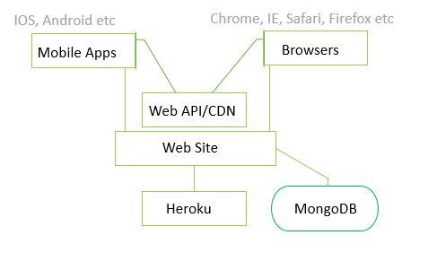

 # **TuttiSmooti & Co.**

#### ***Python (Flask Plug-in) and back-end Development***

The project purpose was to build a full-stack site that allows users to manage a common dataset  
such as the CRUD (Create, Read, Update and Delete) functions for a particular domain.

TuttiSmooti & Co. is an online Smoothie Recipe Book. My task at hand was to create a website using  
HTML, CSS, JavaScript and Python allowing the user(s) to interact, use, and contribute to the  
website. The construction of this website required logical thinking, as a website offering such  
significant functions would require some form of security to protect data from malice i.e. allowing  
anyone to come along and delete ‘all’ recipes.  

The main criteria for this project was to show an understanding of data handling, data structure, and  
user functionalities. 

## **UX**

A Big part of User Experience is to create a product that is useful, useable, and provides value.  
 TuttiSmooti encompasses all of this, as users are able to utilise the website for all of the above   
through functions which allow the user, control over their smoothie submissions.  

Each function is important, and carries out its purpose when invoked. Interacting with the website  
through its functions should produce a positive emotional response.  

#### **Strategy Plane:**

TuttiSmooti will provide its users with a catalogue of smoothie recipes. Smoothies have recently  
comeback into trend, as the public have become more and more aware of what they consume. I  
believe smoothies are generally great for all ages, and good for all seasons, and can be low calorie  
substitute for a sweet tooth. There are now several variations of smoothies, and TuttiSmooti will  
create a user-friendly recipe archive for them. I have chosen to base my smoothie recipes around 3  
categories: Dessert, Protein and Vegan. I believe by offering categories to users will give them more  
control and make the site more search specific to them.  

#### **Scope Plane:**

- As a user I would want the website to be simple and easy to use.  

- I would like for the website to be aesthetically pleasing, and simple when inspecting a single recipe  
to stop me from getting distracted. 

- I would want to contribute, by adding some of my own recipes, and have access to my own recipes  
 on a separate page.  

- Occasionally typos are made when entering data, I would like an option to go back and edit or  
delete my recipe should I need to.  

To assist this, I have created ‘create’, ‘update’, ‘read’ and ‘delete’ functions, which have been made  
 available through buttons.  

At first, it would seem these are the only functions the user would need. However, some form of  
regularity would be needed, whereby restrictions would need to be placed on any user deleting any  
 recipes. The logical solution to this was to create a login system. This became a requirement rather  
than a feature. Implementing a login system was able to facilitate users who have registered to have  
 access to all functions, thus creating some form of control over the recipes added.  

#### **Structure Plane:**  

To simplify the understanding behind the map of TuttiSmooti, this information architecture diagram  
shows a tree structure of how the website is organised, and also illustrates interaction design.  

 

Interaction Design Given the functional requirements, users can interact with the product, using the  
 CRUD functions, for each input required there are a set number or characters that are expected.  
Should the user not comply the system will pop up informative suggestions to assist the user. Upon a  
 successful completion the user will receive a flash message confirming their actions. Another  
example is the installation of a modal to prevent user error or a mistake, the system asks the user to  
 confirm a potentially harmful action such as deletion.  

Information Architecture Given the content requirements, defines the arrangement of content  
elements, for example, the ‘Smoothies’ page has a mid-nav which allows a drop down to categories  
the drinks the user wishes to see. Clear labelling, and the fixed navigation allows the user to explore  
the website with ease. To facilitate easy understanding, some links/ buttons are hidden or made  
available depending on user sessions.  

#### **Skeleton Plane:**
The use of wireframes helps to create a visual format of the end product, this is a Static diagram  
that represent a visual format of the website, including content, navigation and ways for interactions.  
Wireframes were created using moqups.com this allowed me to create a computer, tablet  
and a mobile mock-up of what TootiSmooti & Co. would look like. This helped create a visual of how  
the content would display.

#### ***My Wireframes:***

***Home Page:***  

 

***Smoothies Page:***  

 

***View Recipe:***  

 

***My Smoothies:*** (users posts)  

 

***Add/Edit Smoothies:***  

 

The mobile and large screen design does not differ much, apart from the reduced content  
on the delivery of results shown on each row. There’s also a reduction of text used in headings on a  
smaller screen. This was done to ensure a good customer  
experience with easy read information 

#### **Surface Plane:**  

All users are able to view and narrow down their search using the drop-down menu to view drinks  
 related to their chosen category. The use of pagination was implemented to restrict the number of  
results shown on each page, this makes things easier for the user to understand, and increases their  
 cognitive ability to absorb what they see on the screen.  

There is a sidenav, which has a link for all users to register, once the user has logged in, more links  
 become available. The logged in user has more personal links made available, for example a link to  
view their posts, this page also offers the user tools to create, update and delete their posts as they  
 please. The buttons are clearly labelled, illustrated and coloured to signify the functions, and ease of  
use.

#### **The colour scheme:**

When thinking of smoothies, an array of colours come to mind, the option of bright vibrant fruits  
that blend well to make a sweet concussion. Based on this, I went with vibrant, colourful hero  
images, and chose pastel shades to accent the backgrounds to avoid a clash of colours, and  
maintained that fruitfulness. I used the same colour of #dc3545 (hot pink) as a hover property for  
 icons, and for links in the footer to maintain a colour theme. I used green, red and yellow for action  
 buttons, as I felt it worked in harmony with the hero images, and balanced the overall look and feel  
of the website.  

The top and the side navbars were kept dark and opaque, with white text I found that this gave the   
website a sleek and a classy look.  

## **The walk through**

The home page has a hero image with the brand name ‘TootiSmooti&Co’ as a heading. There’s a  
 subheading which prompts a user to sign up, this is followed by a input bar and a button to submit.  
Which takes logs in and registers the user. Upon scrolling down the navbar remains in its fixed  
position, it has a dark opaque background, this creates a sophisticated style, but also allows ease of  
use should the user decide to move onto another page. There is a bright yellow button on the top  
right allowing easy navigation. The side nav requires to be clicked on to open/closed, and holds a link  
to register. As the page is scrolled down there are 3 short sections which are descriptions of the  
drink categories each have a button to lead the user to a category specific catalogue of recipes.  

 

At the bottom of the page, there is another prompt to signup to the website, followed by a footer,  
with icons for social media, and links for quick navigation.    

Clicking on the ‘smoothies’ link on the top navigation takes you to a page where there’s another  
hero image with a short informative message about the nutritional benefits of smoothies. Just under  
 this image there is a nav which allows a user to filter their search by categories, when a category is  
selected, smoothies belonging to the chosen category display on the same page.  

 

The ‘smoothies’ page displays 12 recipes on each page, these are presented using the drink name,  
image, a short description of the smoothie, the category the drink belongs to, and also its author.  
Below this is a green button to ‘get the recipe’, when clicked this takes the user to a page dedicated  
to the selected drink.  

  

This page has all the details that were displayed on the card, with the addition of a bullet point list of  
ingredients, a short paragraph of directions, indication of servings, and time it takes to make the  
smoothie. There is a short hyperlink under the heading which leads the user to an external allergen’s  
website. The back button redirects to the ‘smoothies’ page if its just a user, however if the user Is  
logged in with an account this will redirect to the user’s posts.  

Login in, this page is simple, it had a background image with a dark opaque box drawing attention to  
the centre of the page, instructions are simple, and state the requirements of the username (5-15  
characters) and require a username to be entered to sign up. Beneath the login button there is a  
link, should the user not have an account with TuttiSmooti, they are able to click on the ‘signup’  
hyperlink which redirects to the registration page. The registration page fits the same description as  
the login page with a different image in the background. 

   

Once user has registered, they are redirected to the ‘smoothies’ page. The ‘Add Smoothie’ button  
now works and takes the user to a form page where details of the new smoothie can be added. The  
sidenav now shows 2 links ‘My Smoothies’ and a ‘Quick add’ link. The Quick add redirects to the  
same page as ‘Add Smoothie’. The link to ‘My Smoothies’ opens up a page which has a hero image, 
 and gives the user a personalised welcome message; just below this there’s a button to add a smoothie.  

   
If the user has previously added smoothie recipes to the website, the user’s posts will appear on this  
page as cards (similarly to how they appear in the ‘smoothies’ link), with the allowance of two  
buttons just beneath the card. One of these buttons ae green with a pen icon, symbolising ‘edit’, the  
other button is red with a trash can icon symbolising delete.  

   

When the delete button is clicked, this triggers a modal which prompts the user to confirm if they  
want to go ahead with the deletion of the recipe, or if they wish to cancel. Upon deleting, the user is  
redirected back to ‘My smoothies’, with a flash message confirming the deletion.  

When the edit button is clicked this redirect to a similar form as the form used to ‘add smoothie’,  
this page however retains the information previously typed, so the user is easily able to make  
amendments to their original recipe.  

Once the user has finished using the website, there’s a ‘logout’ button in place of the ‘login’ button;   
this sits on the top nav. When clicked this would log the user out, and leave a flash message on the   
home screen confirming that the user has been logged out.  

## **Features**
#### **Existing features:**
TuttiSmooti heavily relies on a cloud database to store and pull the recipes for each smoothie.  
Non-relational databases such as MongoDB allows users to store unstructured data, but allows an  
internal structural element. I found this would be the easiest way to manage data, giving the user  
control.  

TootiSmooti’s database has 3 collections: users, drinks, and drink_categories:  

   
The installation of ‘user sessions’ was required to protect the website/recipes from malice. This  
allowed me to offer functions to the authors of smoothies, when logged in, rather than allowing  
anyone to edit or delete recipes as they please. ‘User sessions’ were also used in conjunction with  
python loops to show, hide and replace content such as links and buttons.  

The main feature is the advanced interactive experience the site gives to the user. The inclusive  
nature of the website works by allowing the user to key in recipes as required on the form, which  
immediately creates a recipe card and adds it to the website for all users to view. The website offers  
further functions updating the recipe, the function recall the data in each input field making it easier  
to make amendments as required, the user is also able to delete if the user no longer wishes to  
share their recipe. 

The responsive format of the results, was created using bootstraps grid system, media queries were  
also required for a more user friendly, easy to read display.  

#### **Features left to implement:**  

Ideally, I would like the sidebar to have more content, where the user is able to amend their  
username and profile should they wish to. I would also like to have endorsed utensils and offer  
TootiSmooti&Co. branded utensils to purchase directly from the website.  

I would also have like to have added a star review system, which would advise others of their  
experience of making the recipe.  And also, to have a ‘like’ button which would add the smoothie to  
a separate page dedicated to the user.

Unfortunately, due to time constraints I was unable to complete these, but will look to complete  
these in the near future.

## **Technologies used**  

#### **Front end:** 
***HTML***- hypertext markup language was used to build the basic structure of a website.  
***CSS***- cascading style sheets was used to style HTML  

#### **CDNs:** 
***Popper, JQuery Bootsrap4*** added as bundle: To assist with some content and functions of  
website, such as the Modal, and also supported the layout using Bootstraps grid system.  
***Font Awesome:*** used for the Icons.  

#### **Responsive Events:** 
***JavaScript:*** was used to assist the slide on the side navbar; this was done using  
a ‘click’ event.

#### **Back end:** 
***Flask:*** micro framework for building simple apps   
***Flask-pymongo:*** flask python and mongoDB coalition   
***Flask WTF:*** WTForms and flask coalition   
***Jinja:*** templating language for python  
***MongoDB:*** external cloud database  
***Heroku:*** deployment host  
***Favicon:*** added to change the icon on tab  

## **Testing**  
## **Testing** 

Automated testing- python test
-unit test- testing function in isolation. Focus on 1 function (i.e. addition) to reach expected outcome- use where applicable
-integration test- testing 1+ functionalities. Checks such as character check- checks if the right input has been added to the db- this test the whole route rather than a single function. Use this mainly for the testing
-end-2-end test- mimic human behaviour in testing – from start to finish as a human would check everything- this will do the same. 
The testing is actual bits of code.
Tests need to be stored in a test.py file
#### **[Html validator: ](https://validator.w3.org/#validate_by_input)**
shows following error for index.html: 
>*background-image: Parse Error*  

However, I have assumed the error occurs due to ‘jinja templating’.

#### **[CSS validator:]( https://jigsaw.w3.org/css-validator/)**
Showed errors relating to backgrounds and border colours being the same, the check also  
flagged up the following:
>-webkit-background-size is an unknown vendor extension  
-moz-background-size is an unknown vendor extension  
-o-background-size is an unknown vendor extension  
-webkit-background-size is an unknown vendor extension  
-moz-background-size is an unknown vendor extension  
-o-background-size is an unknown vendor extension  

However, the webkit bundle taken from css-tricks.com to style my background images.

#### **[JS validator:]( https://esprima.org/demo/validate.html)**
Showed the following error:
>Error: Line 1: Unexpected token '<'  

However, this is required for the code to sit within the < script > tags.

#### **[Python validator:]( http://pep8online.com/)**
Showed the following errors:  
>import env  

However, this is used to bind the PyMongo URI, therefore it is a necessary import.  

The Python validator also flagged up the following error:  
>expected 2 blank lines, found 0  

However, this was due to the comments, sitting above the routes.

#### **Responsive Application:** *(Table of Trial and Error)*

<table>
<tbody><tr>
<th>Device</th>
<th>Images</th>
<th>Links</th>
<th>Navbar</th>
<th>Formatting Error</th>
<th>Notes</th>
</tr>
<tr>
<th>Desktop</th>
<td>yes</td>
<td>yes</td>
<td>yes</td>
<td>No Error</td>
<td>Works ok</td>
</tr>
<tr>
<th>Laptop</th>
<td>yes</td>
<td>yes</td>
<td>yes</td>
<td>No Error</td>
<td>Works ok</td>
</tr>
<tr>
<th>IPad</th>
<td>yes</td>
<td>yes</td>
<td>yes</td>
<td>No Error</td>
<td>Works ok</td>
</tr>
<tr>
<th>IPhone X</th>
<td>yes</td>
<td>yes</td>
<td>yes</td>
<td>No Error</td>
<td>Works ok</td>
</tr>
<tr>
<th>IPhone 5</th>
<td>yes</td>
<td>yes</td>
<td>yes</td>
<td>Some Errors</td>
<td>Works ok</td>
</tr>
<tr>
<th>Samsung</th>
<td>yes</td>
<td>yes</td>
<td>yes</td>
<td>No Error</td>
<td>Works ok</td>
</tr>
<tr>
<th>Explorer</th>
<td>yes</td>
<td>yes</td>
<td>yes</td>
<td>No Error</td>
<td>Slight zoomed out appearance</td>
</tr>
<tr>
<th>Safari</th>
<td>yes</td>
<td>yes</td>
<td>yes</td>
<td>No Error</td>
<td>Works ok</td>
</tr>
<tr>
<th>Chrome</th>
<td>yes</td>
<td>yes</td>
<td>yes</td>
<td>No Error</td>
<td>Zoomed in appearance</td>
</tr>
</tbody></table>

#### **My Findings:**

## **Deployment**

This website was deployed on Heroku. Click the link to see my Heroku deployed pages.
1.	You first create a ‘requirements’ file, by typing in the following command in the terminal: 
>Pip3 freeze > requiremnts.txt  

This will create a folder containing all the dependencies for the application.  

2.	You will then need to create a ‘Procfile’, by typing: 
>Echo web: python run.py > Procfile  

This contains the base language for Heroku to base the app on. In this case it is Python.  

3.	This will then need to be pushed before the final steps of pushing our repository to Heroku.
>Git add .  > git commit -m “initial commit to Heroku” > git push  

This will update the repository on GitHub pages.  

4.	Heroku offers up to 5 websites to be deployed for free, if you create and account follow  
the following instructions to create an app in Heroku:
>New > create new app > type in app name and select the ‘region’ which you are in > create app  

This will create an app ready to be linked to your repository.  

5.	To connect the repository to Heroku, select ‘Deploy’ in Heroku, here you will have options  
on how you wish to deploy the project. Select ‘Heroku Git’- this allows the app to connect using  
the CLI (command line interface).
Paste the following commands into the Gitpod terminal:
>$ heroku login (key in your credentials  
>$ git add .  
>$ git commit -am “initial commit to heroku”  
>$ git push Heroku master  

6.	In Heroku settings, select ‘Config Vars’, here you would set Mongo_URI and also your secret keys.  

7.	Your app would have been successfully deployed, select ‘Open app’ to see your live app.  

#### Local Deployment
As a new developer, I would encourage other users to use my code, and make further  
improvements, or even use it to facilitate a project they may be working on.  

This can be done by clicking ‘clone or download’ on my GitHub Directory for my MS3project.  
This should then lead the user to their GitPod workspace where my code would be ready to use.  
The user should then look into the requirements folder and install all plugins required, user  
should also create an ‘env.py’ file which fold secret information, which links to the following  
on the app.py  page:  

* Os.environ.get(‘SECRET_KEY’)
* Os.environ.get(‘MONGO_URI’)  

The user should use MongoDB to create a work space which allows 5 free collections, the user  
should then Create a Database collection called ‘TuttiSmooti’ with 3 collections as follows:  

>Users:
>>      TuttiSmooti.users:
	>>          _id: ObjectId(“…”)  
	>>          username: < string >  

>Categories:
>>      TuttiSmooti.drink_categories:
	>>          _id: ObjectId(“…”)  
	>>          category_name: < string >  

>Drinks:
>>      TuttiSmooti.drinks:
	>>          _id: ObjectId(“…”)
	>>          username: < string >  
	>>          drink_name: < string >  
	>>          description: < string >  
	>>          ingredients: < array >  
	>>          directions: < string >  
	>>          serves: < int >  
	>>          prep_time: < int >  
	>>          img_url: < string >  
	>>          category_name < string >

This should run the application. Where categories are able to be filtered, users are able to see their  
own posts and the create and edit functions would also work with this set up. 

The user should type python3 app.py in the terminal which should create a browser to view their  
app on a local server.  

**## References:**